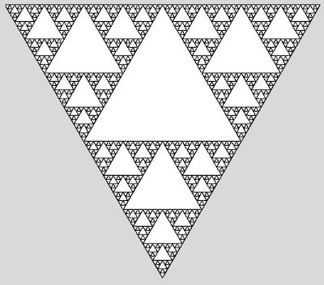
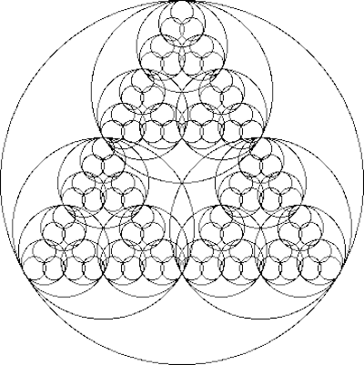
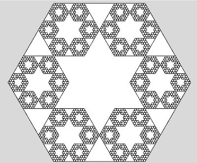
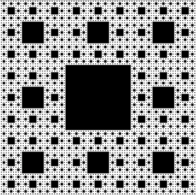
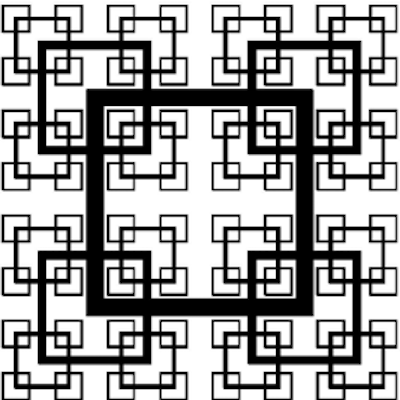
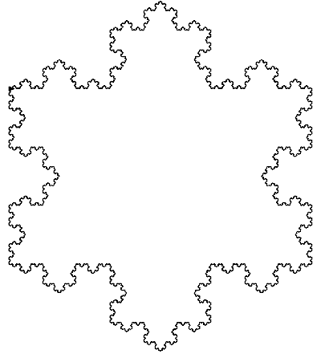
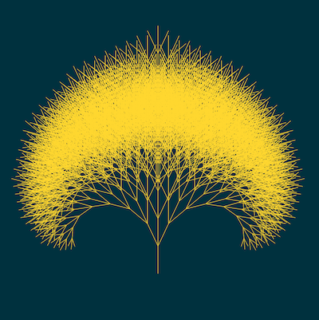

# Project Exercises

Draw fractals with recursive functions.

### Experience points
- Each fractal has a certain amount of experience points (XP) that can be earned by completing it
- To level up and journey safely to the next week's challenges make sure you earn at least 2 XP
- *Tip: Go with 4 XP if you're on __insane__ difficulty setting.*

### Bonus XPs
- make it multi-color for 1 XP
- make the sizes slightly change randomly for 1 XP
- make it animate for 4 XPs

## What is a fractal?
> A fractal is a mathematical set that exhibits a repeating pattern displayed at every scale. It is also known as expanding symmetry or evolving symmetry.
> *[for more detail check [Fractal](https://en.wikipedia.org/wiki/Fractal) on Wikipedia]*

## Fractals for 1 XP

| * | *  |
| --- | --- |
| Triangles         |  |
| Circles           |  |
| Hexagon           |  |
| Sierpinsky carpet |  |
| Square grid       |  |
| Koch line         |   |

## Fractals for 2 XP

| * | *  |
| --- | --- |
| Koch snowflake |  |
| Tree |   |
